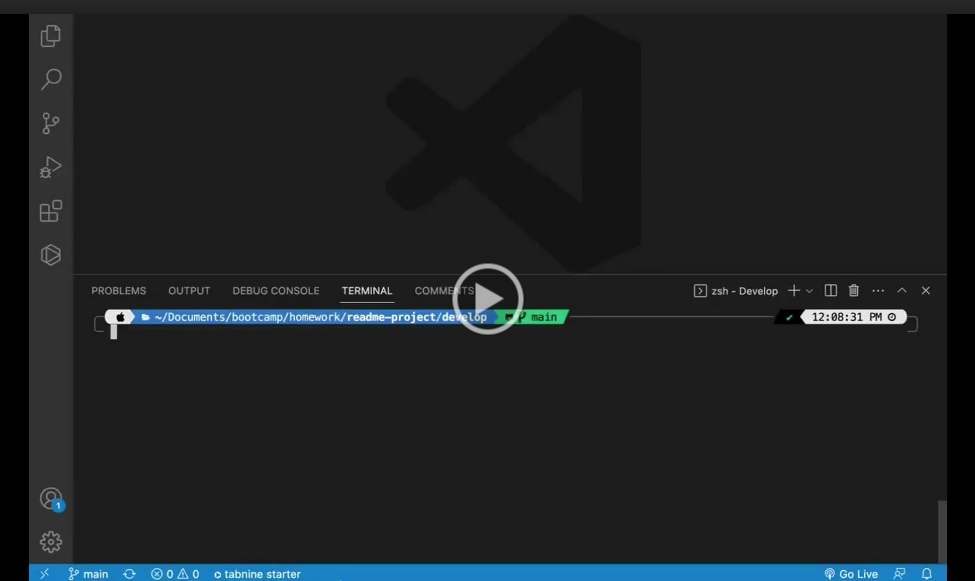

# <Your-Project-Title>

## Description

- As a developer you already have enough on your plate.
- I wanted to make this journey a bit more pleasant by creating this README generator.
- I build this project for developers who like me spend hours creating amazing programs and could use an extra tool in our tool library to ease work load.
- This generator will automatically create your projects README with just a few text inputs  saving you precious time  that can be used  to focus on the more important tasks.
- In this project i learned that you cant never have too much help as a developer.

## Table of Contents (Optional)

- [Installation](#installation)
- [Usage](#usage)
- [Credits](#credits)
- [License](#license)
- [Tests](#tests)

## Installation

1. open terminal cd into file.
2. type node index iin terminal to start generator.
3. Answer questions.

## Usage

[Video walk through](https://drive.google.com/file/d/1RzStkzzi80IDZdgkj-2kafPf7xC20WPK/view)

---
## Credits

List your collaborators, if any, with links to their GitHub profiles.

If you used any third-party assets that require attribution, list the creators with links to their primary web presence in this section.

If you followed tutorials, include links to those here as well.

---
## License

The GNU General Public License is a free, copyleft license for software and other kinds of works.

---
## Badges

---
## Features

1.Generates RADME.md file

---
## How to Contribute

If you would like to contribute or have any questions , please contact me at:

[Email](moraadrian510@icloud.com)

[GitHub](https://github.com/moraadrian510)

---
## Tests

**Coming soon**

---
